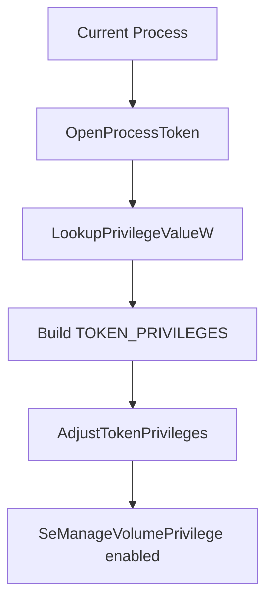
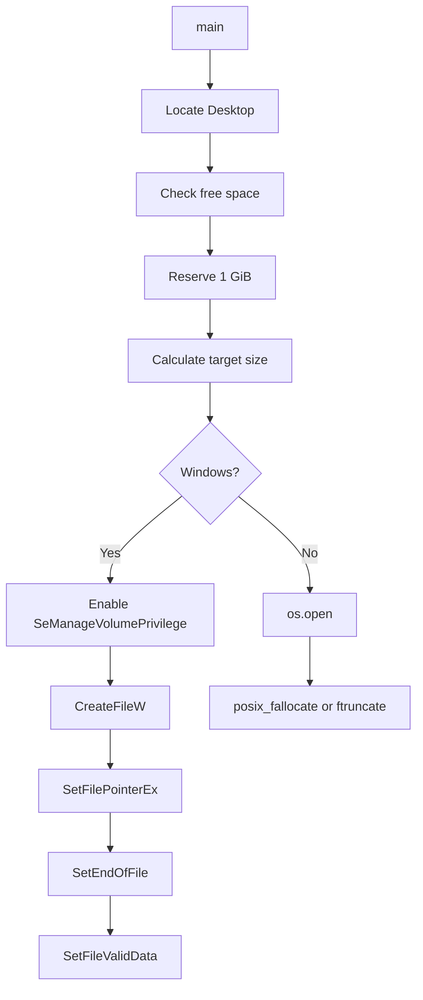

<div align="center">

**Create a file with a huge *logical* size in a fraction of the time it takes to write the same amount of data.**


</div>

---

## Table of Contents

- [Overview](#-overview)
- [The Core Idea](#-the-core-idea)
- [How It Works](#-how-it-works)
  - [Windows](#-windows)
  - [Linux / POSIX](#-linux--posix)
- [Target Size Calculation](#-target-size-calculation)
- [Reading the Benchmark Correctly](#-reading-the-benchmark-correctly)
- [Security Considerations](#-security-considerations)
- [Caveats](#-caveats)
- [Key Takeaways](#-key-takeaways)
- [Disclaimer](#-disclaimer)

---

## Overview

Creating a 50 GB file does **not** necessarily mean writing 50 GB of zeros to the disk.

This project shows how OS and filesystem APIs can create a very large file **without generating or writing every byte from Python**.

```text
Traditional file creation        Fast allocation
─────────────────────────        ─────────────────────────────────
Python                           Python
  ↓ generate data                  ↓ filesystem API call
  ↓ write data                     ↓ metadata / allocation operation
Disk                             File ✔
```

A typical output looks like this:

```text
Free:   100.00 GB
Target: 99.00 GB
Output: C:\Users\User\Desktop\test.bin
Mode:   valid-data (privilege: on)
Done:   99.00 GB in 0.72s
Free:   99.00 GB
```

> [!IMPORTANT]
> `99 GB in 0.72s` is **not** the physical write speed of your disk. See [Reading the Benchmark Correctly](#-reading-the-benchmark-correctly).

---

## The Core Idea

```text
Logical File Size   ≠   Amount of Data Physically Written
```

A filesystem stores a file's size as **metadata**. Changing that metadata does not require a buffer holding the whole file.

```text
Before                    After
──────────                ──────────────
test.bin                  test.bin
size = 0                  size = 50 GiB
```

### The slow way

```python
with open("test.bin", "wb") as f:
    f.write(b"\x00" * (10 * 1024**3))   # actually processes ~10 GiB
```

### The fast way

Ask the filesystem to make the file that large, and let the OS handle the rest.

| Approach | What the app does | Work scales with size? |
|---|---|:---:|
| `write()` zeros | Generates and transfers every byte | ✅ Yes |
| Allocation API | Sends one request to the filesystem | ❌ Mostly no |

---

## ⚙️ How It Works

### 🪟 Windows

The Windows path calls four WinAPI functions through `ctypes`:


| Step | API | What it does |
|:---:|---|---|
| 1 | `CreateFileW()` | Creates the file (`CREATE_ALWAYS` replaces any existing file) and returns a handle |
| 2 | `SetFilePointerEx()` | Moves the file pointer to `size`. **Writes nothing.** |
| 3 | `SetEndOfFile()` | Declares the pointer position as the end of file, so the file now reports the full size |
| 4 | `SetFileValidData()` | Marks the range as valid so Windows can skip zero-initialization. Needs a special privilege |

```python
h = k32.CreateFileW(str(path), GENERIC_WRITE, 0, None,
                    CREATE_ALWAYS, FILE_ATTRIBUTE_NORMAL, None)

k32.SetFilePointerEx(h, size, None, FILE_BEGIN)
k32.SetEndOfFile(h)
k32.SetFileValidData(h, size)
```

#### Two possible outcomes

`alloc_nt(path, size) -> bool` returns `True` only if `SetFileValidData()` succeeds.
If it fails, the file can still have the requested size because `SetEndOfFile()` may already have succeeded.

| Mode | Meaning |
|---|---|
| `valid-data` | `SetEndOfFile` **and** `SetFileValidData` succeeded |
| `eof-only` | Only `SetEndOfFile` succeeded (no privilege) |

#### `SeManageVolumePrivilege`

`SetFileValidData()` is protected by this privilege, so the program tries to enable it first:



> [!NOTE]
> The privilege is typically available only when running as Administrator.

#### Why `ctypes`?

Python doesn't wrap every Windows API. `ctypes` lets it call DLL exports directly:

```python
k32 = ctypes.WinDLL("kernel32",  use_last_error=True)
adv = ctypes.WinDLL("advapi32",  use_last_error=True)

k32.SetEndOfFile.argtypes = [wintypes.HANDLE]
```

Some APIs expect C structs, so the memory layout is recreated with `ctypes.Structure`:

```python
class LUID(ctypes.Structure):
    _fields_ = [("LowPart", wintypes.DWORD),
                ("HighPart", ctypes.c_long)]

class LUID_AND_ATTRIBUTES(ctypes.Structure):
    _fields_ = [("Luid", LUID),
                ("Attributes", wintypes.DWORD)]

class TOKEN_PRIVILEGES(ctypes.Structure):
    _fields_ = [("PrivilegeCount", wintypes.DWORD),
                ("Privileges", LUID_AND_ATTRIBUTES * 1)]
```

### Linux / POSIX

```python
def alloc_posix(path: Path, size: int) -> bool:
    fd = os.open(path, os.O_WRONLY | os.O_CREAT | os.O_TRUNC, 0o644)
    ...
```

| Priority | Call | Behavior |
|:---:|---|---|
| 1 | `os.posix_fallocate(fd, 0, size)` | Requests allocation of the file space |
| 2 | `os.ftruncate(fd, size)` | Fallback: sets the logical size |

The exact physical behavior depends on the OS and filesystem.

---

## Target Size Calculation

```python
GB = 1 << 30                # 1,073,741,824 bytes (technically 1 GiB)
RESERVE_BYTES = 1 * GB      # leave ~1 GiB untouched

free  = shutil.disk_usage(target.parent).free
total = max(0, free - RESERVE_BYTES)
```

```text
Available   50 GiB
Reserved  −  1 GiB
─────────────────
Target      49 GiB
```

The reserve prevents the program from consuming all free space on the volume.

Timing uses `time.monotonic()`, which is not affected by system clock changes:

```python
t0 = time.monotonic()
...
dt = time.monotonic() - t0
```

---

## Complete Execution Flow



---

## Reading the Benchmark Correctly

Suppose the program prints:

```text
Done: 80.00 GB in 0.50s
```

It's tempting to compute `80 GB ÷ 0.5 s = 160 GB/s`. **That number is meaningless here**, because no 80 GB of user data was written.

| ❌ Wrong interpretation | ✅ Correct interpretation |
|---|---|
| "My disk wrote 160 GB/s" | "The filesystem completed the size/allocation request in 0.50 s" |

This benchmark should be described as **fast logical file allocation**, not as disk write throughput.

### Logical size vs physical allocation

A file has both:

- **Logical size**: what the file reports
- **Allocated physical blocks**: what the filesystem actually reserved

How these relate depends on the filesystem and allocation method. A large reported size does not mean the same amount of user data was written.

---

## Security Considerations

`SetFileValidData()` is fast partly because it can skip zero-filling newly exposed disk regions. Those regions may still contain **stale data from files previously stored on the disk**, which is why Windows gates the API behind a privilege.

> [!WARNING]
> Treat this as a filesystem/API experiment, not a general-purpose file-creation or benchmarking tool.
> Don't run it on a disk holding important data unless you understand the storage and filesystem semantics.

---

## Caveats

Results vary a lot depending on:

| Factor | Examples |
|---|---|
| Filesystem | NTFS, ReFS, ext4, XFS, Btrfs |
| Storage | SSD, HDD, storage controller |
| Environment | Virtual machine, cloud storage |
| Security | Disk encryption, system permissions |
| Capacity | Available free space |

So never claim *"any 100 GB file can be created in exactly 1 second."*
A more accurate statement:

> Large logical files can sometimes be created extremely quickly because the program avoids writing the entire file contents.

---

## Key Takeaways

```text
1. Don't generate N GB of data.
2. Ask the filesystem for a file of size N GB.
3. Let the operating system handle the allocation semantics.
```

```text
File Size        ≠   Amount of User Data Written
Fast Allocation  ≠   Fast Physical Storage Throughput
```

---

## Disclaimer

This project demonstrates filesystem allocation behavior.

It does **not** bypass physical storage limits, create real storage capacity, or achieve impossible disk-write speeds. Reported times reflect the completion of the selected filesystem operations, not the physical throughput of the underlying storage device.
